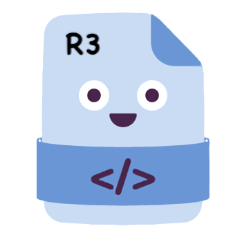

<a href="https://github.com/reactivemarbles/observableevents">
    
</a>

# Observable Event Generator for [R3](https://github.com/Cysharp/R3)

**This repository's implementation is identical to the upstream, with only structural adjustments.**

This project is a .NET source generator which produces `Observable<T>` for events contained within a object including all base classes. `ObservableEvents` generator will convert events within an assembly and create observable wrappers for them, it is based on [Pharmacist](https://github.com/reactiveui/Pharmacist) and uses [.NET Source Generator](https://docs.microsoft.com/en-us/dotnet/csharp/roslyn-sdk/source-generators-overview) technology.

## NuGet Packages

Make sure your project is using the newer `PackageReference` inside your CSPROJ. The older style is buggy and should be moved away from regardless. See here for discussions how to [upgrade](https://docs.microsoft.com/en-us/nuget/consume-packages/migrate-packages-config-to-package-reference).

Install the following packages to start using Observable Events.

| Name                          | Platform          | NuGet                            |
| ----------------------------- | ----------------- | -------------------------------- |
| [R3Extensions.ObservableEvents.SourceGenerator][Core]       | Core - Libary     | [![CoreBadge]][Core]             |

[Core]: https://www.nuget.org/packages/R3Extensions.ObservableEvents.SourceGenerator/
[CoreBadge]: https://img.shields.io/nuget/v/R3Extensions.ObservableEvents.SourceGenerator.svg

## Manual Installation

Include the following in your .csproj file

```xml
<PackageReference
    Include="R3.ObservableEvents.SourceGenerator"
    Version="1.3.0"
    PrivateAssets="all" />
```

The `PrivateAssets` will prevent the ObservableEvents source generator from being inherited by other projects.

## How to use

### Instance Based

It injects a class for instance based events into your source code which will expose a extension method called `Events()`. You need to include the namespace `R3.ObservableEvents` to access to the extension method. You can then use this to get `Observable<T>` instances from your events.

```cs
using R3.ObservableEvents;

public void MyClass : INotifyPropertyChanged
{
  // Assumes this belong in a class with a event called PropertyChanged.
  public void RunEvents()
  {
      this.Events().PropertyChanged.Subscribe(x => Console.WriteLine($"The {x} property has changed"));
  }

  public event PropertyChangedEventHandler PropertyChanged;
}
```

### Static Events

You must use include a attribute `GenerateStaticEventObservables` on the assembly level for a particular class. This will generate a class `RxEvents` in the same namespace as the specified class.

```cs
[assembly: GenerateStaticEventObservablesAttribute(typeof(StaticTest))]
public static class StaticTest
{
    public static event EventHandler? TestChanged;
}
```
